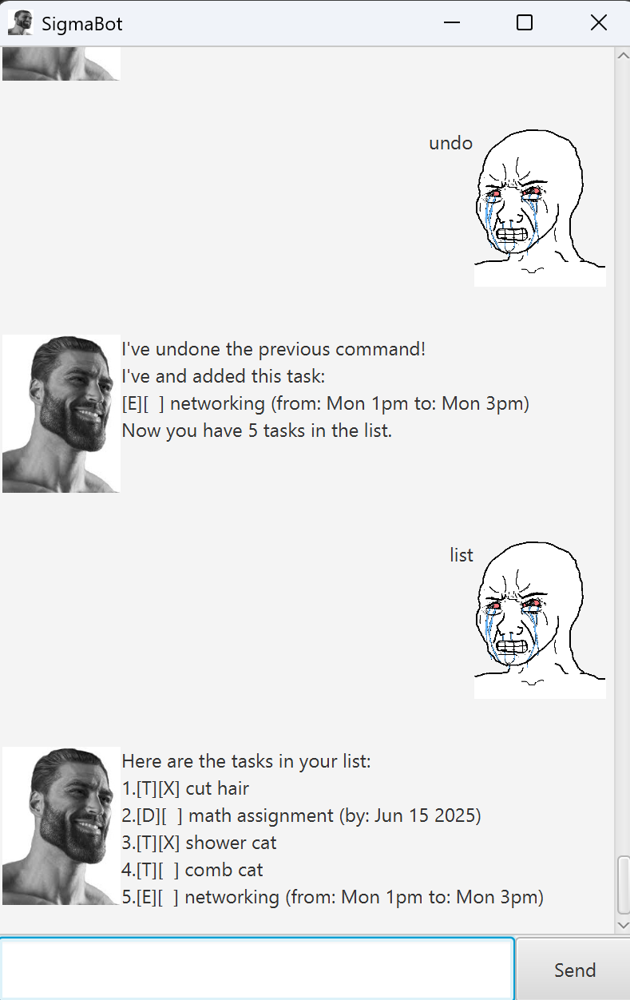

# SigmaBot User Guide



SigmaBot is a desktop chatbot for managing tasks, optimized for fast command input with a modern GUI. You can quickly add todos, deadlines, and events, and manage them efficiently with simple commands!

Note: Bro is nonchalant and mogging, and will ignore most invalid commands. 

---

## Quick Start

1. Ensure you have Java 17 or above installed on your computer.
2. Download the latest SigmaBot `.jar` file from [GitHub Releases](https://github.com/McFishhh/ip/releases).
3. Place the `.jar` file in your desired folder.
4. Open a terminal, `cd` into the folder, and run:
   ```
   java -jar SigmaBot.jar
   ```
5. The GUI will appear. Type commands in the input box and press Enter for SigmaBot to start tracking your tasks!

---

## Features

- Add tasks: Todo, Deadline, Event
- Mark and unmark tasks as done
- Delete tasks
- List all tasks
- Find tasks by keyword
- Undo previous command
- Save and load tasks automatically
- Robust input validation (including date checks)
- Friendly error messages for invalid commands
- GUI support (JavaFX)

---

## Command Format Notes

- Words in UPPER_CASE are parameters to be supplied by the user.
  - Example: `todo DESCRIPTION`
- Extra parameters for commands that do not take them are ignored.
  - Example: `list`, `bye`

---

## Feature Details

### Adding a Todo: `todo`
Adds a todo task.

**Format:**  
```
todo DESCRIPTION
```
**Example:**  
```
todo read book
```

<br/>

### Adding a Deadline: `deadline`
Adds a deadline task with a specific date.

**Format:**  
```
deadline DESCRIPTION /by yyyy-MM-dd
```
**Example:**  
```
deadline submit report /by 2025-09-21
```

<br/>

### Adding an Event: `event`
Adds an event task with start and end times.

**Format:**  
```
event DESCRIPTION /from START /to END
```
**Example:**  
```
event meeting /from 2pm /to 4pm
```

<br/>

### Listing All Tasks: `list`
Shows all tasks.

**Format:**  
```
list
```

<br/>

### Marking a Task: `mark`
Marks a task as done.

**Format:**  
```
mark INDEX
```
**Example:**  
```
mark 2
```

<br/>

### Unmarking a Task: `unmark`
Unmarks a task.

**Format:**  
```
unmark INDEX
```
**Example:**  
```
unmark 2
```

<br/>

### Deleting a Task: `delete`
Deletes a task.

**Format:**  
```
delete INDEX
```
**Example:**  
```
delete 3
```

<br/>

### Finding Tasks: `find`
Finds tasks containing the keyword.

**Format:**  
```
find KEYWORD
```
**Example:**  
```
find book
```

<br/>

### Undoing the Previous Command: `undo`
Undoes the previous command.

**Format:**  
```
undo
```

<br/>

### Exiting SigmaBot: `bye`
Exits SigmaBot and saves your tasks.

**Format:**  
```
bye
```

---

## Saving and Editing Data

- Tasks are updated after any command that changes the data, and saved when the program exits via the `bye` command.
- Data is stored in a text file.
  - save path: `saves\savedTasks.txt`
- **Caution:** Editing the data file manually may cause SigmaBot to ignore malformed lines.

---

## FAQ

**Q:** How do I transfer my tasks to another computer?  
**A:** Copy the save file from your SigmaBot folder to the same location on the other computer.

---

## Known Issues

- Invalid date formats or commands are ignored.
- GUI may not display correctly on some screen resolutions.
- Force exiting the GUI will cause changes to not be saved. 

---


## Command Summary

| Action      | Format                                   | Example                                   |
|-------------|------------------------------------------|-------------------------------------------|
| Add Todo    | `todo DESCRIPTION`                       | `todo read book`                          |
| Add Deadline| `deadline DESCRIPTION /by yyyy-MM-dd`    | `deadline submit report /by 2025-09-21`   |
| Add Event   | `event DESCRIPTION /from START /to END`  | `event meeting /from 2pm /to 4pm`         |
| Mark        | `mark INDEX`                             | `mark 2`                                  |
| Unmark      | `unmark INDEX`                           | `unmark 2`                                |
| Delete      | `delete INDEX`                           | `delete 3`                                |
| Find        | `find KEYWORD`                           | `find book`                               |
| List        | `list`                                   |                                                   |
| Undo        | `undo`                                   |                                                   |
| Exit        | `bye`                                  |                                                   |