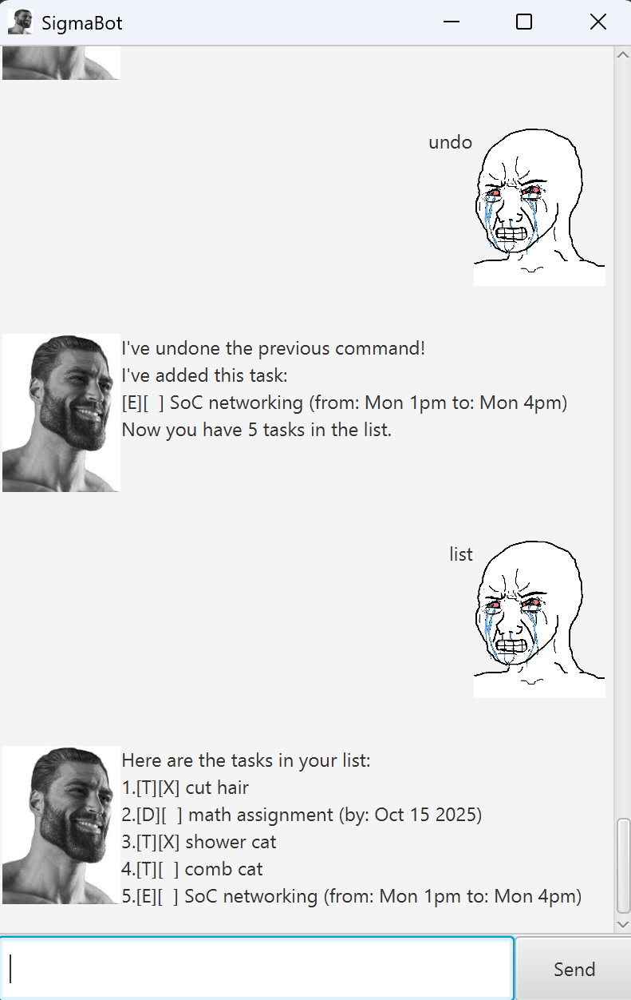

# SigmaBot User Guide



SigmaBot is a task management chatbot for desktop. It helps you organize your todos, deadlines, and events, and supports undo and search!

---

## Features

- Add tasks: Todo, Deadline, Event
- Mark and unmark tasks as done
- Delete tasks
- List all tasks
- Find tasks by keyword
- Undo previous command
- Save and load tasks from file
- Robust input validation (including date checks)
- Error messages for invalid commands
- GUI support (JavaFX)

---

## Command List

| Command | Format | Example | Description |
|---------|--------|---------|-------------|
| Add Todo | `todo <description>` | `todo read book` | Adds a todo task |
| Add Deadline | `deadline <description> /by yyyy-MM-dd` | `deadline submit report /by 2025-09-21` | Adds a deadline task |
| Add Event | `event <description> /from <start> /to <end>` | `event meeting /from 2pm /to 4pm` | Adds an event task |
| List Tasks | `list` | `list` | Shows all tasks |
| Mark Task | `mark <task_number>` | `mark 2` | Marks a task as done |
| Unmark Task | `unmark <task_number>` | `unmark 2` | Unmarks a task |
| Delete Task | `delete <task_number>` | `delete 3` | Deletes a task |
| Find Tasks | `find <keyword>` | `find book` | Finds tasks containing the keyword |
| Undo | `undo` | `undo` | Undoes the previous command |
| Exit | `bye` | `bye` | Exits SigmaBot |

---

## Adding Deadlines

To add a deadline task, use the following command format:

Example:  
`deadline submit assignment /by 2025-09-21`

Expected outcome:
```
Got it. I've added this task:
[D][ ] submit assignment (by: 2025-09-21)
Now you have 1 tasks in the list.
```

---

## Adding Events

To add an event task, use the following command format:

Example:  
`event project meeting /from 14:00 /to 16:00`

Expected outcome:
```
Got it. I've added this task:
[E][ ] project meeting (from: 14:00 to: 16:00)
Now you have 2 tasks in the list.
```

---

## Marking and Unmarking Tasks

Example:  
`mark 1`

Expected outcome:
```
Nice! I've marked this task as done:
[D][X] submit assignment (by: 2025-09-21)
```

Example:  
`unmark 1`

Expected outcome:
```
OK, I've marked this task as not done yet:
[D][ ] submit assignment (by: 2025-09-21)
```

---

## Deleting Tasks

Example:  
`delete 2`

Expected outcome:
```
Noted. I've removed this task:
[E][ ] project meeting (from: 14:00 to: 16:00)
Now you have 1 tasks in the list.
```

---

## Finding Tasks

Example:  
`find assignment`

Expected outcome:
```
Here are the matching tasks in your list:
1. [D][ ] submit assignment (by: 2025-09-21)
```

---

## Undoing Commands

Example:  
`undo`

Expected outcome:
> Reverse effect of previous command. 

---

## Exiting SigmaBot

Example:  
`bye`

Expected outcome:
> Tasks are saved, and progarm exits!

---

## More Features

- All tasks are saved automatically and loaded when you start SigmaBot.
- Invalid commands or dates are ignored.

---

## Getting Started

1. Download and run SigmaBot.
2. Type your commands in the input box.
3. See your tasks organized instantly!

